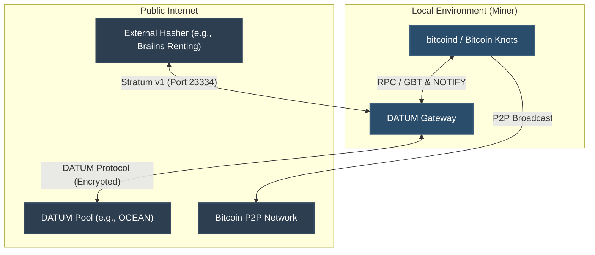
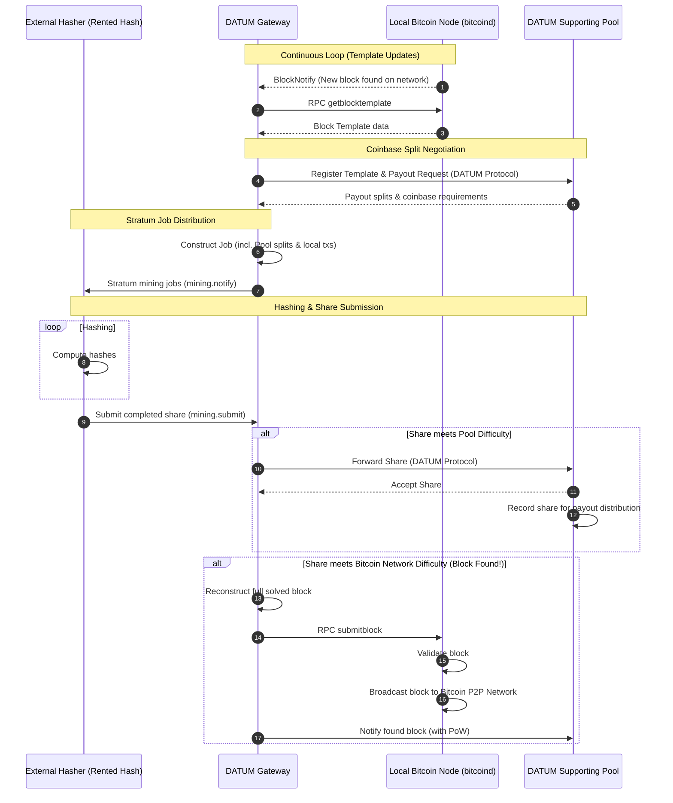

## Architecture

Participating systems:
* **Local Bitcoin Node (`bitcoind` / `bitcoinknots`)**: A fully synchronized node that compiles transaction lists and generates block templates.
* **DATUM Gateway**: The local coordinator that manages block templates, handles the Stratum server endpoint, negotiates payout splits with the pool, and submits winning blocks.
* **External Hasher (Rented Hashpower)**: Mining hardware (e.g., rented from Braiins) acting as a Stratum client that connects to the DATUM Gateway to receive jobs and compute hashes.
* **DATUM-Supporting Mining Pool (e.g., OCEAN)**: The pool that coordinates the coinbase transaction payout splits (such as via TIDES) and validates submitted shares to distribute rewards proportionate to the hashpower contributed.

Collaboration flow:
* Hashpower is rented from the external hasher.
* The hasher connects to the DATUM Gateway via the Stratum TCP protocol on port `23334` over the public internet.
* The DATUM Gateway continually queries the local Bitcoin node for block templates using the RPC `getblocktemplate` method.
* The DATUM Gateway communicates with the mining pool via the encrypted, custom **DATUM Protocol** to obtain the required coinbase payout splits for the local templates.
* The DATUM Gateway constructs mining jobs (incorporating local transactions and the pool's payout splits) and sends them to the hasher.
* The hasher computes hashes and sends completed shares (solved nonces) back to the DATUM Gateway.
* The DATUM Gateway submits valid shares matching the pool's difficulty to the pool via the DATUM protocol.
* The mining pool records the shares and distributes payouts directly to the miner's payout address.

When a block is found (a share meets the Bitcoin network difficulty):
* The hasher submits the winning share to the DATUM Gateway.
* The DATUM Gateway reconstructs the full solved block.
* The DATUM Gateway submits the solved block directly to the local Bitcoin node (and any configured upstream backup nodes) using the `submitblock` RPC method.
* The local Bitcoin node validates and broadcasts the solved block directly to the Bitcoin P2P network.
* The DATUM Gateway notifies the pool of the won block via the DATUM protocol to coordinate payout distribution.

Collaboration diagram:


Sequence diagram:


## Recommended partners

* [Braiins](https://hashpower.braiins.com/) - rent hashpower
* [OCEAN mining](https://ocean.xyz/) - minin pool that supports DATUM

## Configuration

### Datum

Location: `$NODE_DATA_DIR/datumgateway/data/config/config.json`

```json
{
    "bitcoind": {
        "rpccookiefile": "/var/run/bitcoin/.cookie",
        "rpcurl": "http://bitcoind.bitcoin.local:8332"
    },
    "mining": {
        "pool_address": "<bitcoin payout address>",
        "coinbase_tag_secondary": "myminername"
    },
    "api": {
        "admin_password": "secret",
        "listen_port": 7152,
        "modify_conf": false
    }
}
```

*Exposed ports:*
* `23334` - default Stratum TCP endpoint to which the hasher connects to, it must be exposed on the public internet
* `7152` (Internal) -  Your DATUM Gateway admin UI, accessible externally via HAProxy at http://datumgateway.local 


### Bitcoind

Location: `$NODE_DATA_DIR/bitcoind/data/bitcoin/bitcoin.conf`

Notifying Datum when new block is found:
```
blocknotify=wget -q -O /dev/null http://datumgateway.bitcoin.local:7152/NOTIFY
```
